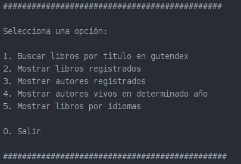
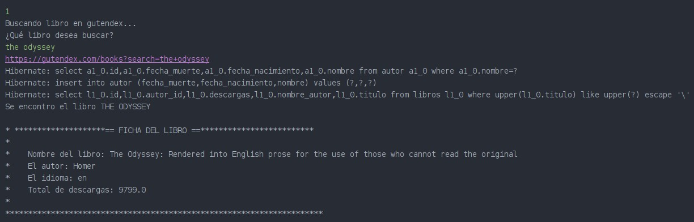
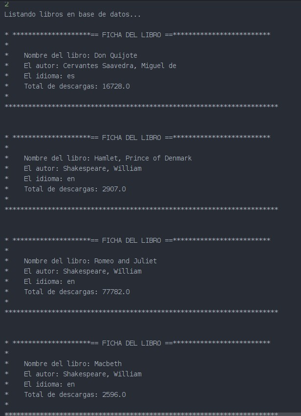
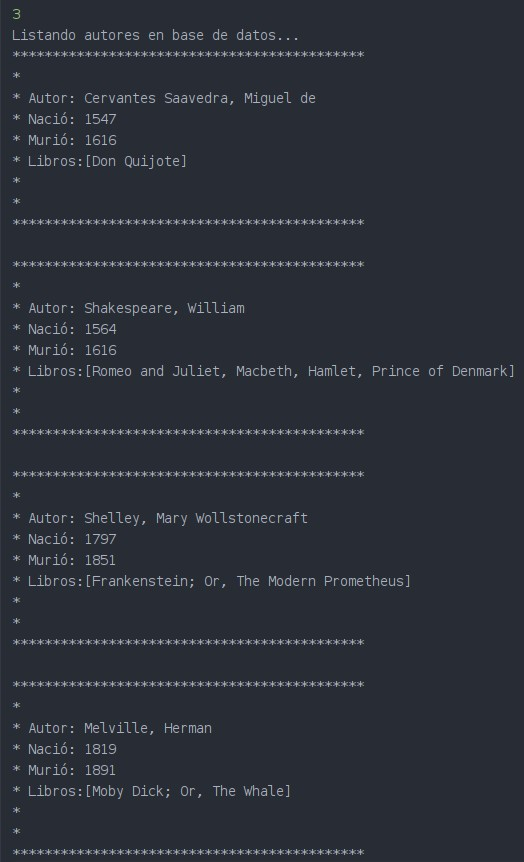
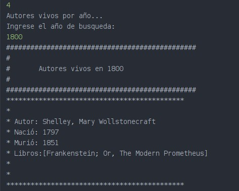
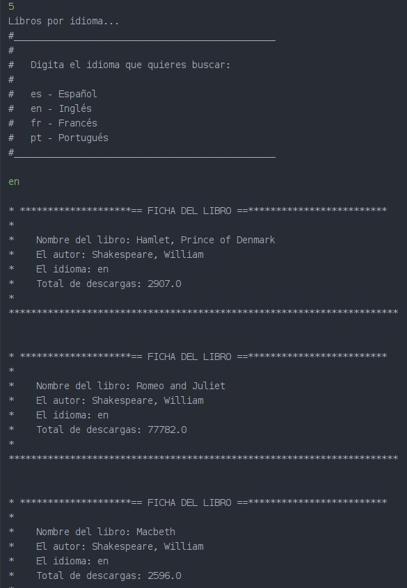

# 📙Literalura #
Primer Challenge de programa ONE G6 para Backend

## 📄 Resumen ##
El challenge pretende consumir datos de la API de Gutendex. 
1. Se busca busca el libro dado por el usuario.
2. Se Muestra los elementos en la base de datos local.
3. Se Muestran los autores en la Base de datos local.
4. Se Muestran los autores vivos en determinado año.
5. Se buscan los libros por idiomas.

   _El menú principal._
   
   

## 1. Buscar libros en Gutendex 🔎.
- Se pide al usuario el libro a buscar.
Esto se logra con un nextLine, se almacena el nombre del libnro, luego se arma la url de búsqueda el libro, después se manda esta URL a la API de consumo, la cual nos devolvera el resultado como un String.
- Convertir String en Libro.
Del String obtenido se obtiene la primer coincidencia con el título buscado, y se comvierten a un dato del tipo libro. Si el libro no existe se muestre un mensaje  de *"Libro no encontrado"*
- Obtener Autor.
Se extrae la String del autor, para después convertirla a un dato de tipo Autor.
- Consultar si existe el autor.
Se consulta en la base de datos de autores si el autor del libro existe en la Base de Datos. Si existe se traen los datos a nuestro programa, si no existe se crea el registro.
- Consultar si existe el libro.
Se busca el libro en la base de datos, si existe se devuelve el mensaje *"Libro ya existe"*, sino, se guarda en la BD.

_Ejemplo de búsqueda._

## 2. Muestra los elementos en la base de datos local 📝.
Mediante un findAll() aplicado a la base de datos de libros desde el repositorio de Libros se obtienen todos los libros, para despues mostrarlos con un forEach().

_Ejemplo de consuta en la BD._

## 3. Muestra los autores en la Base de datos local 🙋🏾. 
Mediante un findAll() aplicado a la base de datos de autores desde el repositorio de Libros se obtienen todos los libros, para despues mostrarlos con un forEach().

_Ejemplo de consulta de autores en BD._

## 4. Muestra los autores vivos en determinado año 🤹🏿‍♂️.
-Se pide el año de búsqueda.
Haciendo uso del scanner se pregunta al usuario el año en el cual consultaremos los autores vivos.
-Búsqueda con Query
Hace uso de un @Query para cosulta de los registros con año de Nacimiento mayor o igual al dado  por el usuario y menor o igual a la fecha de muerte.
-Mostar resultados
Si se encotraron autores del año _Buscado,  se listan, sino, se lanza mensaje de no encotrado nunguna autro

_Ejemplo de autores vivos por año._

   
## 5. Buscar los libros por idiomas 🇲🇽.
- Se muestra un submenú para mostrar los idiomas disponibles
Se pide al usuario que ingrese una opción de búsqueda.   
- Se buscan los libros por idioma.
Mendiante un Query se busca en la base de datos y se almacenan en una lista los libro sencontrados del idioma buscado.
 
_Ejemplo de búsqueda por idioma._

